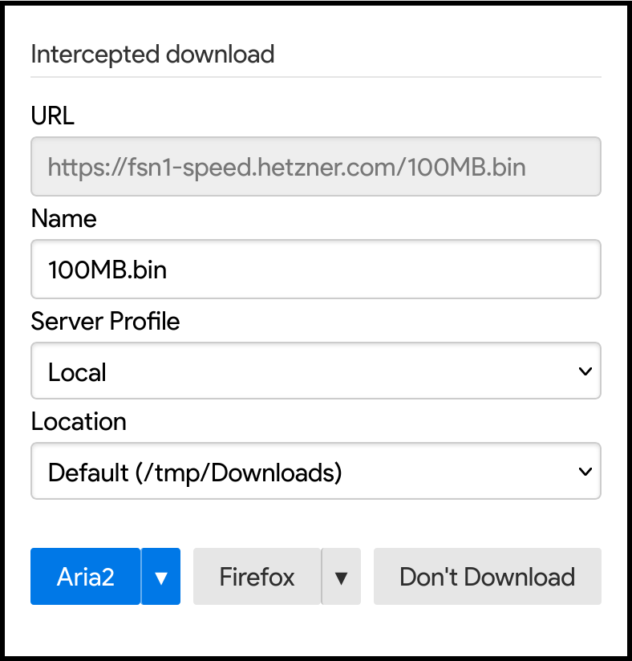
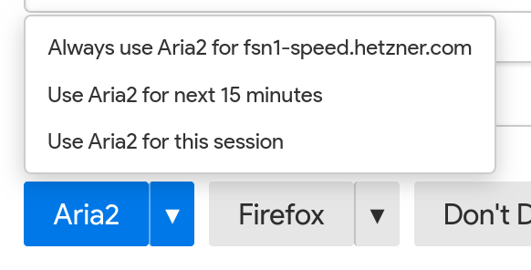
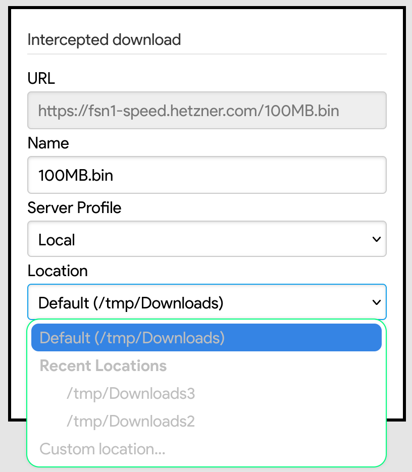
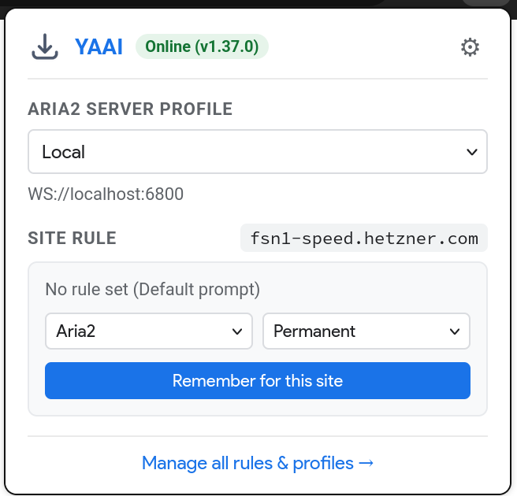
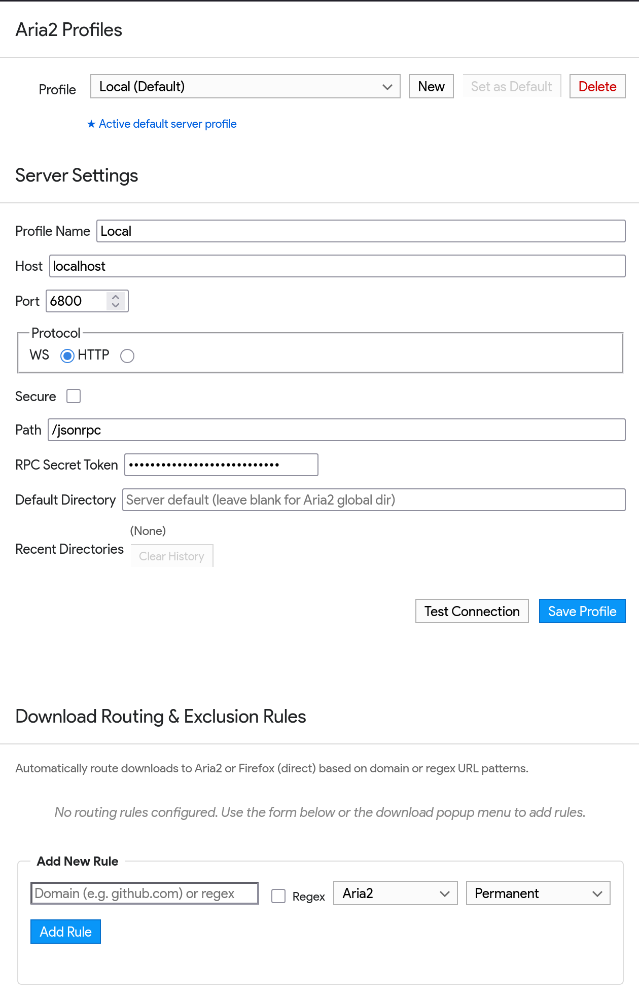

# YAAI - Yet Another Aria2 Integrator

YAAI is a modern Firefox extension that intercepts browser downloads and seamlessly forwards them to [Aria2](https://aria2.github.io) via its JSON-RPC interface.

Instead of opening disruptive browser windows or separate popups, YAAI embeds a native, lightweight `<dialog>` directly into the webpage for non-intrusive download management.

---

## Features

### 1. In-Page Intercepted Download Dialog
Intercepts file downloads and displays an in-page prompt to confirm or customize the download. You can quickly edit the filename, select an Aria2 server profile, pick a download location, and choose where to route the download.

  

### 2. Flexible Site Routing Rules (Aria2 vs. Firefox)
Want to skip the prompt for certain sites or file patterns? Use the split dropdown buttons (`▾`) on either **Aria2** or **Firefox** to remember your preference:
- **Always for domain**: Permanently route downloads for that site.
- **Next 15 minutes**: Temporarily snooze the prompt (ideal for batch or multi-file downloads).
- **This session**: Remember your choice until Firefox restarts.

  

### 3. Server Profiles & Remembered Locations
Manage multiple Aria2 servers (e.g., Local, NAS, Seedbox) with independent RPC credentials, protocols (HTTP/WebSocket), and default directories. The location selector remembers recent directories per profile and allows typing custom paths on the fly.

  

### 4. Toolbar Popup Menu
Click the YAAI icon in the Firefox toolbar to check live server connectivity, switch your active server profile, and inspect or toggle routing rules for the active tab with one click.

  

### 5. Comprehensive Options & Rules Management
A centralized preferences page to configure server profiles, test RPC connections, and manage all domain and regular expression routing rules with expiration countdowns.

  

---

## Installation

Here are the steps to manually install YAAI:
1. Switch to Firefox Developer Edition, Nightly, or unbranded Firefox (to allow installing unsigned extensions).
2. Open `about:config` and toggle:
   - `xpinstall.signatures.required` to `false`
   - `dom.dialog_element.enabled` to `true`
3. Run `npm run pack` to generate `addon.zip` (or zip the contents inside [`addon`](addon) directly).
4. Open `about:addons` and drag-and-drop `addon.zip` to install (or visit `about:debugging` &rarr; "This Firefox" &rarr; "Load Temporary Add-on..." and select `addon/manifest.json`).
5. Open extension preferences (or click the toolbar icon ⚙) to configure your Aria2 server profiles and settings.

---

## Acknowledgements

YAAI is mostly a rewrite of the download interception logic from [Aria2-Integration](https://github.com/RossWang/Aria2-Integration/) in ES7. I've found it to be the best in terms of actually intercepting valid downloads and forwarding them to Aria2.

The problem is that for user confirmation of the download, that extension creates a new browser window in the dimensions of a dialog box, without actually marking the window as a "Dialog". This means, whenever the download panel pops up, my Window Manager remembers those dimensions for the entire Firefox class, and the next time I open my browser, it starts as a small sized box, which is obviously very irritating.

Instead, YAAI injects a [`<dialog>`](https://developer.mozilla.org/en-US/docs/Web/HTML/Element/dialog) into the webpage to ask for user confirmation, which is much better in terms of performance too (creating a new window is very expensive for a browser).
